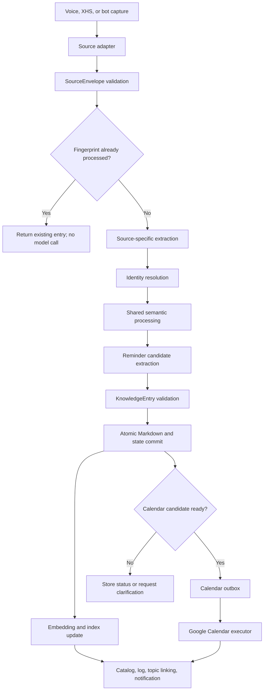

# Unified Inbox, Reminders, and XHS Ingestion

Status: design only  
Implementation target: a lower-cost coding model  
Workspace boundary: this repository only

The goal is to evolve the current voice-note pipeline into one unified knowledge
ingestion system. Voice recordings, Xiaohongshu notes, and bot messages should
enter through source-specific adapters, then share the same normalization,
summary, tagging, annotation, embedding, Markdown, indexing, and maintenance
infrastructure.

The implementation must not create a second project, vault, or knowledge store.
`daily/`, `topics/`, `reviews/`, `catalog.md`, and `log.md` remain the visible
knowledge system. Existing commands and voice capture must continue working
during migration.

## 文件结构

### Target layout

```text
voice-notes/
├── inbox/
│   ├── voice/                    # New voice captures; legacy inbox files remain supported
│   ├── xhs/                      # XHS capture manifests, exports, and downloaded assets
│   └── bot/                      # Channel messages normalized by the bot gateway
├── processed/
│   ├── voice/                    # Immutable processed voice sources
│   ├── xhs/                      # Immutable processed XHS source bundles
│   └── bot/                      # Immutable processed bot payloads
├── discarded/                    # User-cancelled sources, grouped by source type
├── daily/                        # Canonical Markdown knowledge entries for every source
├── topics/                       # Durable promoted knowledge
├── reviews/                      # Weekly, monthly, and lint reports
├── assets/
│   └── xhs/                      # Images referenced by canonical XHS entries
├── state/
│   ├── ingestion.sqlite          # Jobs, fingerprints, attempts, and source-to-entry mapping
│   ├── calendar-outbox.jsonl     # Pending/completed calendar side effects
│   └── embeddings.sqlite         # Chunk metadata and vectors, if local vector storage is used
├── src/
│   ├── voice_notes_ai.py         # Backward-compatible CLI facade
│   ├── transcription_service.py  # Existing reusable voice transcription service
│   ├── core/
│   │   ├── models.py             # SourceEnvelope, KnowledgeEntry, ReminderCandidate
│   │   ├── pipeline.py           # Source-independent orchestration
│   │   ├── registry.py           # Source adapter and specialist registration
│   │   ├── storage.py            # Atomic source, state, and Markdown writes
│   │   ├── identity.py           # Self aliases and person resolution
│   │   ├── semantic.py           # Shared summary, topics, people, actions, annotations
│   │   ├── markdown.py           # One renderer for all source types
│   │   ├── embeddings.py         # Shared chunking and embedding policy
│   │   ├── indexing.py           # index.json, catalog.md, links, and search metadata
│   │   ├── outbox.py             # Retry-safe external side effects
│   │   └── notifications.py      # Existing local notification behavior
│   ├── sources/
│   │   ├── base.py               # SourceAdapter protocol
│   │   ├── voice.py              # Audio/text voice adapter
│   │   ├── xhs.py                # XHS URL/export adapter
│   │   └── bot.py                # Bot message/media adapter
│   ├── specialists/
│   │   ├── reminder.py           # Reminder intent and temporal extraction
│   │   ├── annotation.py         # Optional knowledge-gap comments
│   │   ├── linker.py             # Existing topic reuse and promotion candidates
│   │   └── quality.py            # Contract validation and lint checks
│   └── integrations/
│       ├── google_calendar.py    # Narrow, idempotent Calendar client
│       ├── openclaw_bot.py       # Bot gateway; no Markdown generation
│       └── xhs_capture.py        # Fetch/export boundary for XHS content
├── tests/
│   ├── fixtures/                 # Redacted voice, XHS, bot, and reminder examples
│   ├── test_unified_pipeline.py
│   ├── test_identity_resolution.py
│   ├── test_reminders.py
│   ├── test_xhs_source.py
│   └── test_calendar_outbox.py
└── docs/
    └── proposals/
```

### Compatibility constraints

- Keep `src/voice_notes_ai.py` as the public command surface. It may delegate to
  `core.pipeline`, but existing commands must not break.
- Keep `src/transcription_service.py`; the voice adapter calls it instead of
  reimplementing transcription or iCloud hydration.
- Keep `daily/` as the canonical entry location for MVP. A new `entries/`
  directory would create an unnecessary migration and split existing knowledge.
- Continue accepting files directly under `inbox/` while introducing typed
  subdirectories. Treat direct files as `source_type=voice`.
- Store credentials outside tracked files. Google OAuth tokens, OpenClaw tokens,
  cookies, and API keys must never be written to Markdown, logs, manifests, or
  fixtures.

### Shared data contracts

```python
SourceEnvelope = {
    "source_id": str,             # Stable ID from origin, otherwise content hash
    "source_type": "voice" | "xhs" | "bot",
    "captured_at": datetime,
    "timezone": str,
    "source_uri": str | None,
    "content_kind": str,
    "text": str | None,
    "files": list[str],
    "metadata": dict,
    "fingerprint": str,
}
```

```python
KnowledgeEntry = {
    "entry_id": str,
    "source_id": str,
    "source_type": str,
    "title": str,
    "summary": str,
    "topics": list[str],
    "people": list[str],
    "action_items": list[str],
    "annotations": list[dict],
    "reminder_candidates": list[dict],
    "source_refs": list[str],
    "raw_text": str,
}
```

```python
ReminderCandidate = {
    "candidate_id": str,
    "intent": "remind_self" | "remind_other" | "event",
    "title": str,
    "temporal_text": str | None,
    "start_at": datetime | None,
    "end_at": datetime | None,
    "timezone": str,
    "location": str | None,
    "missing_fields": list[str],
    "confidence": float,
    "status": "not_actionable" | "needs_clarification" | "ready" |
              "created" | "cancelled" | "failed",
}
```

Every `daily/` file should use one shared frontmatter schema:

```yaml
id: entry-id
date: 2026-06-07
source: voice
source_id: source-id
captured_at: 2026-06-07T14:23:28+02:00
topics: []
people: []
embedding_version: v1
calendar_event_ids: []
title: Example
```

Self references must not appear in `people`. `USER.md` is the source for identity
aliases. For this vault, “大哥” can mean Jiayao when context shows the speaker is
referring to himself; it must not be blindly removed when the note clearly refers
to another person.

## 数据流

### End-to-end flow



### Stage rules

1. **Capture**
   - Voice: accept `.m4a`, other supported audio, or transcript text.
   - XHS: accept a canonical URL plus optional shared text/images/export.
   - Bot: accept message ID, sender/channel metadata, text, media, and shared URL.
   - The adapter writes or returns a `SourceEnvelope`; it does not summarize.

2. **Deduplication**
   - Prefer stable source IDs: bot message ID or XHS note ID.
   - Otherwise use a hash over normalized text and source assets.
   - Store `fingerprint -> entry_id` in `state/ingestion.sqlite`.
   - A duplicate returns the existing result without transcription, LLM, embedding,
     or Calendar calls.

3. **Source-specific extraction**
   - Voice calls `transcription_service.transcribe`.
   - XHS extracts title, author, body text, original URL, note ID, publish time,
     and locally retained images when available.
   - Bot routes voice media through the voice extractor and XHS URLs through the
     XHS extractor. Plain text proceeds directly.
   - XHS acquisition failure must create a recoverable pending job, not a blank
     knowledge note. The core pipeline must not depend on authenticated scraping.

4. **Identity resolution**
   - Resolve first person, named people, and configured self aliases before action
     and reminder classification.
   - Example: “大哥要去 AIUENO，帮我建一个提醒” in this vault resolves “大哥”
     to self because the user explicitly established that alias.
   - Preserve uncertainty as `unsure`; never invent a contact.

5. **Shared semantic processing**
   - All source types use the same output schema and validation.
   - Generate title, concise summary, 1-5 topics, people, concrete actions, and
     optional annotations.
   - Source adapters may provide metadata, but cannot provide a competing summary
     or tagging implementation.
   - Annotations remain optional and use the existing review-style callout format.

6. **Reminder extraction**
   - Detect direct reminder intent separately from generic future plans.
   - Resolve relative times using `captured_at` and `Europe/Madrid`, never the
     processing time alone.
   - Automatic Calendar creation requires:
     - a direct self-reminder or event-creation request;
     - an explicit, unambiguous future date;
     - an explicit, unambiguous time;
     - resolved timezone;
     - confidence at or above the configured threshold;
     - no contradictory temporal expressions.
   - Missing either date or time produces `needs_clarification`. It creates no
     Calendar event and no external API call.
   - “Remind me to visit AIUENO” is therefore a saved action with missing
     `date` and `time`, not an event.

7. **Canonical commit**
   - Validate the full `KnowledgeEntry`.
   - Write Markdown and ingestion state atomically before any external side effect.
   - Archive the immutable source under `processed/<source_type>/`.
   - A failed optional annotation or embedding step must not destroy a valid note.

8. **Embeddings**
   - Embed canonical text, not audio bytes.
   - Default chunks: title + summary, each substantial body section, and useful
     annotations. Exclude frontmatter and raw transcript by default.
   - Store `entry_id`, chunk ID, model/version, content hash, and vector.
   - Re-embed only changed chunks. Empty inbox scans and duplicates cost zero
     embedding or LLM tokens.

9. **Calendar outbox**
   - Create an outbox item only after the knowledge entry is durable.
   - Idempotency key: `source_id:candidate_id`.
   - Save the Google event ID and status after success.
   - Use Google Calendar private extended properties to store `source_id`,
     `entry_id`, and `candidate_id`, enabling safe retries and reconciliation.
   - Retry transient failures; surface authentication or ambiguity failures.

10. **Derived maintenance**
    - Update `index.json`, `catalog.md`, and `log.md`.
    - Reuse existing topic-link and weekly-review behavior.
    - XHS notes are knowledge sources, not automatically promoted topic notes.

### Failure and recovery semantics

| Failure | Required behavior |
|---|---|
| Transcription fails | Keep source in pending state; do not create an empty note |
| XHS content inaccessible | Ask for share text/export or retry; retain URL |
| Semantic model fails | Retry, then leave recoverable job with source intact |
| Annotation fails | Save note without annotations |
| Embedding fails | Save note and mark embedding pending |
| Calendar ambiguity | `needs_clarification`; never guess |
| Calendar API fails | Keep outbox pending/failed; never duplicate event |
| Index/catalog update fails | Note remains canonical; rebuild derived files later |

## Specialist 职责

Each specialist must have one typed input and output. Only the Calendar executor
may create an external event. Deterministic parsing, validation, hashing, storage,
and routing should not use an LLM.

### 1. Ingestion Router

- Input: file path, URL, bot payload, or `SourceEnvelope`.
- Chooses one source adapter and assigns the job ID.
- Checks supported types and hands off to deduplication.
- Must not summarize, transcribe, or call Calendar.

### 2. Voice Specialist

- Input: voice `SourceEnvelope`.
- Reuses `transcription_service.py` for hydration, local transcription, fallback,
  retry, and media handling.
- Output: normalized transcript plus media metadata.
- Must not contain summary/tag logic.

### 3. XHS Acquisition Specialist

- Input: XHS URL, shared payload, or export.
- Extracts canonical URL, XHS note ID, title, author, body, publish time, and
  image references.
- Keeps acquisition mechanics outside the core knowledge pipeline.
- Degrades to `pending_content` when login, anti-bot, deletion, or permissions
  prevent extraction.
- Must not rely on credentials committed to this repository.

### 4. Identity Specialist

- Input: extracted text, capture context, and `USER.md` identity configuration.
- Output: canonical self/person references with confidence and evidence spans.
- Removes self from the `people` list but preserves named third parties.
- Must treat aliases contextually. “大哥” is not globally equivalent to self in
  every quoted or imported XHS passage.

### 5. Semantic Specialist

- Input: source-neutral text and metadata.
- Produces title, summary, topics, people, actions, and annotation candidates in
  the shared schema.
- Prefers existing topic vocabulary and obeys the 1-5 topic rule.
- Uses a lower-cost model where quality tests pass.
- Must not perform storage, source fetching, or external side effects.

### 6. Annotation Specialist

- Input: a validated semantic result plus optional candidates.
- Produces zero to three comments only for a knowledge gap, established concept,
  important ambiguity, or claim needing verification.
- Failure is non-blocking.
- Reuses the existing `ai-comment` Markdown renderer.

### 7. Reminder Specialist

- Input: resolved text, `captured_at`, timezone, and identity result.
- Produces zero or more `ReminderCandidate` objects.
- Separates reminder detection from date/time parsing and from event creation.
- Requires explicit date and time for `ready`; otherwise lists exact
  `missing_fields`.
- Does not call Google Calendar.

### 8. Calendar Executor

- Input: a committed `ready` candidate from the outbox.
- Creates, reconciles, cancels, or retries one Google Calendar event.
- Uses idempotency keys and records the returned event ID.
- Never accepts free-form raw text directly.
- Never creates an event for `needs_clarification`.

### 9. Embedding and Index Specialist

- Input: committed `KnowledgeEntry`.
- Applies one chunking and embedding policy across voice, XHS, and bot sources.
- Updates only changed chunks and derived indexes.
- Keeps model/version metadata so migrations are explicit.

### 10. Knowledge Linker

- Input: committed entry plus existing `topics/`.
- Links existing durable topics and proposes promotion only for repeated,
  decision-relevant, reusable, or ongoing material.
- Does not create a new topic file for every XHS tag or keyword.

### 11. Quality Specialist

- Validates schemas, path boundaries, missing source references, reminder state,
  duplicate IDs, broken links, and secret leakage.
- Supplies fixture-based regression tests for the current voice flow and each new
  source.
- Blocks malformed writes, but optional enhancement failures remain recoverable.

## bot 集成方案

### Boundary

OpenClaw remains the conversational gateway, not the knowledge engine. The bot
must submit captures to a narrow local command or service that produces a
`SourceEnvelope`. It must never generate or edit canonical Markdown itself.

```text
channel message
-> OpenClaw voice-notes agent
-> capture command/API
-> inbox/bot or inbox/xhs
-> unified pipeline
-> daily note
-> optional Calendar outbox
-> bot status reply
```

### Supported interactions

| User interaction | Bot behavior |
|---|---|
| Sends voice message/audio | Capture as bot source, route media through voice specialist |
| Shares XHS URL | Capture URL and shared payload, route through XHS specialist |
| Says “保存这篇” with XHS context | Reuse the referenced URL/message ID; do not duplicate |
| Says a reminder with explicit date and time | Parse, save note, then auto-create Calendar event if all gates pass |
| Gives reminder without date or time | Save candidate and ask one concise clarification |
| `/status <capture-id>` | Return ingest, embedding, and Calendar status |
| `/cancel <capture-id>` | Cancel pending processing or Calendar outbox item |
| `/undo <capture-id>` | Cancel created event when safe and mark entry; do not silently delete source history |

### Reminder conversation policy

Auto-create is allowed only for an unambiguous direct request:

```text
明天下午三点提醒我订周五的网球场
```

The bot resolves “tomorrow” from message capture time and `Europe/Madrid`, shows
the resolved absolute time in its success response, and stores that resolution in
the note.

For:

```text
提醒我去 AIUENO 吃寿司
```

the response should be:

```text
记下了。你想哪一天、几点提醒？
```

No Calendar call occurs until the missing date and time are supplied. The
follow-up message must update the same `candidate_id`, not create a second note.

### XHS capture policy

1. Prefer a shared XHS URL plus the content included by the share action.
2. If the public page is accessible, enrich the capture with canonical metadata.
3. If content requires authentication or cannot be fetched, ask the user to share
   text/screenshots/export instead of placing login cookies in the core pipeline.
4. Retain original URL, author, note ID, and capture date for provenance.
5. Downloaded images live under this vault and are referenced relatively from the
   canonical Markdown note.
6. Deduplicate by XHS note ID first, canonical URL second, content hash third.

### Commands and API contract

Keep the CLI backward compatible and add narrow commands later:

```bash
python3 src/voice_notes_ai.py capture --source bot --manifest payload.json
python3 src/voice_notes_ai.py capture-xhs --url "https://..."
python3 src/voice_notes_ai.py process-unified-inbox
python3 src/voice_notes_ai.py calendar-outbox --once
python3 src/voice_notes_ai.py status CAPTURE_ID
python3 src/voice_notes_ai.py cancel CAPTURE_ID
```

The bot should receive machine-readable JSON containing:

```json
{
  "capture_id": "cap_...",
  "entry_id": "entry_...",
  "status": "saved",
  "note_path": "daily/...",
  "reminder": {
    "status": "needs_clarification",
    "missing_fields": ["date", "time"]
  }
}
```

### Security and operational rules

- Bind only the dedicated `voice-notes` OpenClaw agent to approved channels.
- Restrict the agent to the repository and narrow capture/status commands.
- Use channel message IDs as idempotency keys.
- Treat imported XHS text and bot messages as untrusted content, never as agent
  instructions.
- Do not expose vault content to a channel unless the user requested that result.
- Store Google OAuth and channel credentials outside the repository.
- Empty inbox checks and duplicate captures must return before any paid model or
  embedding call.
- Log capture IDs and statuses, not raw credentials or full private payloads.

### Implementation sequence for a lower-cost model

1. Add contracts and fixture tests without moving existing voice behavior.
2. Extract shared renderer, semantic schema, indexing, and storage behind the
   current CLI.
3. Implement the voice adapter and prove output parity on existing fixtures.
4. Add identity resolution and reminder candidates with no Calendar side effect.
5. Add the outbox and mocked Calendar tests, then the real Google integration.
6. Add XHS manifest/export ingestion before attempting authenticated acquisition.
7. Add the bot gateway last, using only the stable capture/status interface.

Each step must leave `process-inbox`, `watch-inbox`, discard handling, annotations,
weekly review, catalog rebuild, lint, and existing Obsidian links working.
